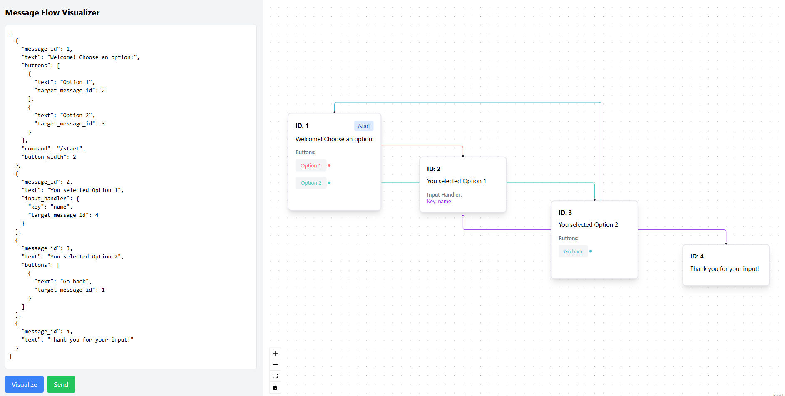

# **DynBOT**

### **Описание проекта**

Этот проект разработан в рамках **Education Hour** для демонстрации возможностей `aiogram-dialog`.  
Он включает:

- **Бэкенд** на **FastAPI** с использованием **FastStream**
- **Телеграм-бот** на **aiogram-dialog** с использованием **FastStream** и **Dishka**
- **Фронтенд** на **React** для визуализации диалогов

### **Функциональность**

✅ Визуализация сообщений, кнопок и инпутов  
✅ Разные цвета стрелок для связи кнопок с сообщениями  
✅ Перетаскивание узлов для удобства просмотра  
✅ Редактирование JSON в текстовом поле  
✅ Отправка JSON на сервер

---

## **Запуск проекта**

```bash
pip install poetry
poetry install
poetry shell
````

### **1. Бэкенд (FastAPI с FastStream)**

```bash
docker-compose up
uvicorn --factory app.main:create_app --host localhost --port 8000
```

### **2. Телеграм-бот (aiogram-dialog с FastStream)**

```bash
python -m app.presentation.telegram.main
```

### **3. Фронтенд (React)**

```bash
npm install
npm run dev
```

### **Пример JSON для визуализации**

```json
[
  {
    "message_id": 1,
    "text": "Welcome! Choose an option:",
    "buttons": [
      {
        "text": "Option 1",
        "target_message_id": 2
      },
      {
        "text": "Option 2",
        "target_message_id": 3
      }
    ],
    "command": "/start",
    "button_width": 2
  },
  {
    "message_id": 2,
    "text": "You selected Option 1",
    "input_handler": {
      "key": "name",
      "target_message_id": 4
    }
  },
  {
    "message_id": 3,
    "text": "You selected Option 2",
    "buttons": [
      {
        "text": "Go back",
        "target_message_id": 1
      }
    ]
  },
  {
    "message_id": 4,
    "text": "Thank you for your input!"
  }
]

```

### **Структура JSON-сообщений**

JSON представляет собой список объектов Message, где каждое сообщение содержит:

```python
@dataclass
class Button:
    text: str
    target_message_id: int

    def to_dict(self) -> dict:
        return {"text": self.text, "target_message_id": self.target_message_id}


@dataclass
class TextHandler:
    key: str
    target_message_id: int


@dataclass
class Message:
    message_id: int
    text: str
    command: str | None = None
    buttons: list[Button] = field(default_factory=list)
    button_width: int | None = None
    input_handler: TextHandler | None = None

```

- **`message_id`** – уникальный идентификатор сообщения.
- **`text`** – текст сообщения.
- **`command`** *(опционально)* – команда, связанная с этим сообщением.
- **`buttons`** *(список `Button`)* – кнопки, ведущие к другим сообщениям.
    - **`text`** – текст кнопки.
    - **`target_message_id`** – ID сообщения, к которому ведет кнопка.
- **`button_width`** *(опционально)* – ширина кнопок.
- **`input_handler`** *(`TextHandler`)* – обработчик пользовательского ввода.
    - **`key`** – ключ для хранения введенных данных.
    - **`target_message_id`** – ID сообщения, к которому ведет ввод.  
